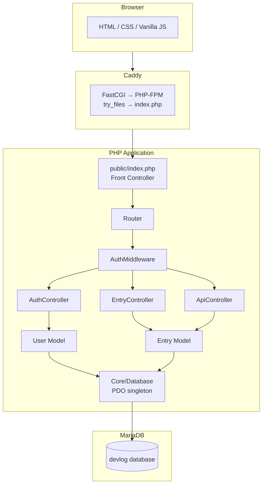

# Project Overview

## What DevLog Is

DevLog is a private, self-hosted developer journal. It is a single web application that lets one or more registered users create, manage, and search written entries about their technical work. Entries support Markdown, carry a status lifecycle (Draft → Published → Archived), and can have file attachments. A JSON API exposes the same data for programmatic use.

It is not a blog platform, task manager, or public tool. It is a personal engineering notebook with a browser interface and an API.

---

## Architecture

DevLog follows the classic MVC pattern on a LAMP stack, without a framework. Every architectural layer is explicit and visible — the goal is learning, not abstraction.

### Request Lifecycle

1. Caddy receives the HTTP request on port 8080
2. `try_files` falls through to `public/index.php` for all non-static paths
3. `index.php` loads environment, starts session, boots the router
4. Router matches `METHOD + URI` to a controller method
5. `AuthMiddleware::require()` redirects unauthenticated requests to `/login`
6. Controller calls Model methods (PDO prepared statements against MariaDB)
7. Controller passes data to `View::render()`, which wraps a view file in `layout.php`
8. HTML response returned to browser

API requests follow the same path but terminate at `ApiController`, which reads `Authorization: Bearer <token>` instead of session, and returns JSON.

---

## Key Design Decisions

**No framework.** Every layer — routing, views, auth, database access — is written from scratch. This is deliberate: the project exists to learn PHP, not to learn Laravel. A framework would hide the concepts the project is designed to expose.

**Front controller pattern.** All HTTP requests enter through `public/index.php`. The document root is `public/`, not the repo root. This keeps source files, config, and vendor dependencies inaccessible to the web server.

**PDO with prepared statements throughout.** No raw string interpolation in SQL. Every user-supplied value goes through a bound parameter. The `Database` class is a singleton to avoid multiple connections per request.

**Soft delete.** Entries are never hard-deleted. `deleted_at IS NULL` filters them from all queries. This preserves data integrity and makes accidental deletion recoverable.

**Backed enum for status.** `EntryStatus` is a PHP 8.1+ backed enum with a `canTransitionTo()` guard. The database stores the string value; PHP enforces valid transitions.

For formal decision records see [`docs/project/decisions/`](project/decisions/).

---

## Directory Map

| Path | Purpose |
|---|---|
| `public/` | Web-accessible root. Only this directory is served by Caddy. |
| `public/index.php` | Front controller. All requests enter here. |
| `src/Core/` | Framework primitives: Router, View, Database |
| `src/Controllers/` | Request handlers. Thin — delegate to Models. |
| `src/Models/` | Database interaction. All SQL lives here. |
| `src/Middleware/` | Auth guard. Called by controllers that require login. |
| `src/Enums/` | Typed constants with behaviour (EntryStatus). |
| `views/` | PHP templates. Rendered by `View::render()`. |
| `config/` | `app.php` — environment-aware config array. |
| `database/` | `schema.sql` — source of truth for DB structure. |
| `scratch/` | Gitignored. Class exercises and local experiments. |
| `docs/` | All project documentation. |
